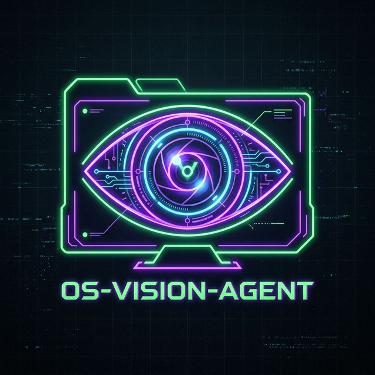
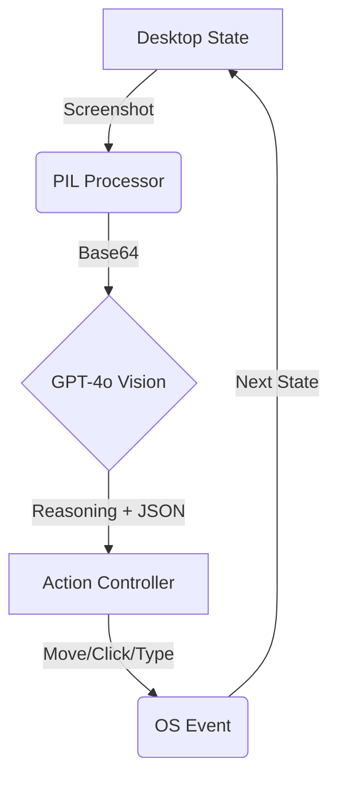

<p align="center">
  
</p>

# 👁️ OS-Vision-Agent

> **The World's First High-Performance, Vision-Agnostic OS Operator.** No APIs, No Selectors—Just Pure Vision.

[](https://github.com/RayeesYousufGenAi/os-vision-agent)
[](https://openai.com/)
[](https://pyautogui.readthedocs.io/)

---

## 🧠 The Concept

**OS-Vision-Agent** bridges the gap between AI and the Desktop. Unlike traditional automation tools that require "selectors" or "DOM access," this agent interacts with your system exactly like a human: it **sees** the screen, **reasons** about the UI, and **acts** via the mouse and keyboard.

> [!TIP]
> This "Vision-First" approach makes it compatible with everything: legacy enterprise software, native Mac/Windows apps, and custom 3D environments.

---

## 🔥 Key Technical Features

- **🌐 Vision-to-Action Loop**: 
  1. `capture_screen()`: High-res screen capture and local pre-processing.
  2. `get_gpt_action()`: Multimodal reasoning via GPT-4o-Vision to determine intent.
  3. `execute_action()`: Low-level OS control via calibrated PyAutoGUI wrappers.
- **📐 Coordinate Mapping**: Normalized 0-1000 coordinate system ensures consistent performance across high-DPI (Retina) and standard displays.
- **🛡️ Built-in Failsafe**: Immediate abort mechanism (Corner Fail-Safe) prevents runaway operations.

---

## 🚀 Setting Up the Ghost Operator

### 1. Requirements
- **Python**: 3.9+
- **OpenAI API Key**: (GPT-4o access required)

### 2. Installation
```bash
git clone https://github.com/RayeesYousufGenAi/os-vision-agent.git
cd os-vision-agent
python3 -m venv venv
source venv/bin/activate
pip install -r requirements.txt
```

### 3. Configuration
Create a `.env` file in the root:
```env
OPENAI_API_KEY=sk-your-key-goes-here
```

### 4. Deployment
```bash
python3 app.py
```
**Recommended Goal**: *"Open Chrome, search for the best pizza in New York, and find the first review."*

---

## 🛠️ System Architecture



---

## ⚠️ Privacy & Safety
- **Visibility**: The agent requires the target application to be visible on the primary monitor.
- **Data**: Screenshots are sent to OpenAI's API. Do not use with sensitive information visible.
- **Failsafe**: Slam your mouse into any corner of the screen to kill the process instantly.

---

## 📄 License
MIT License. Explore and expand.

---

<p align="center">Empowering the Autonomy of the Desktop 👁️🦾</p>
